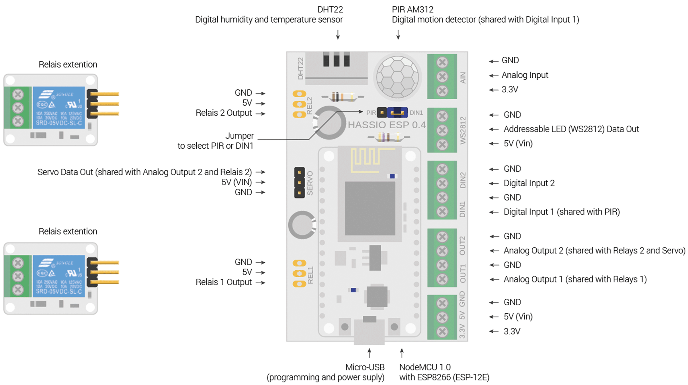
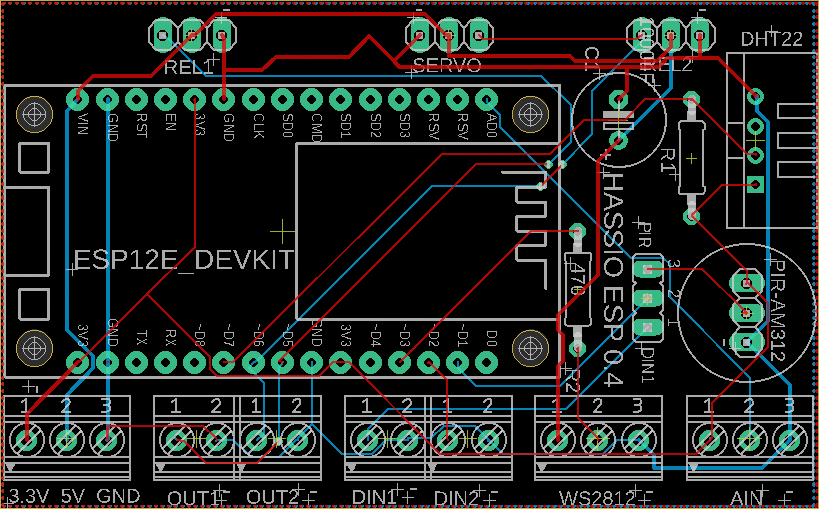
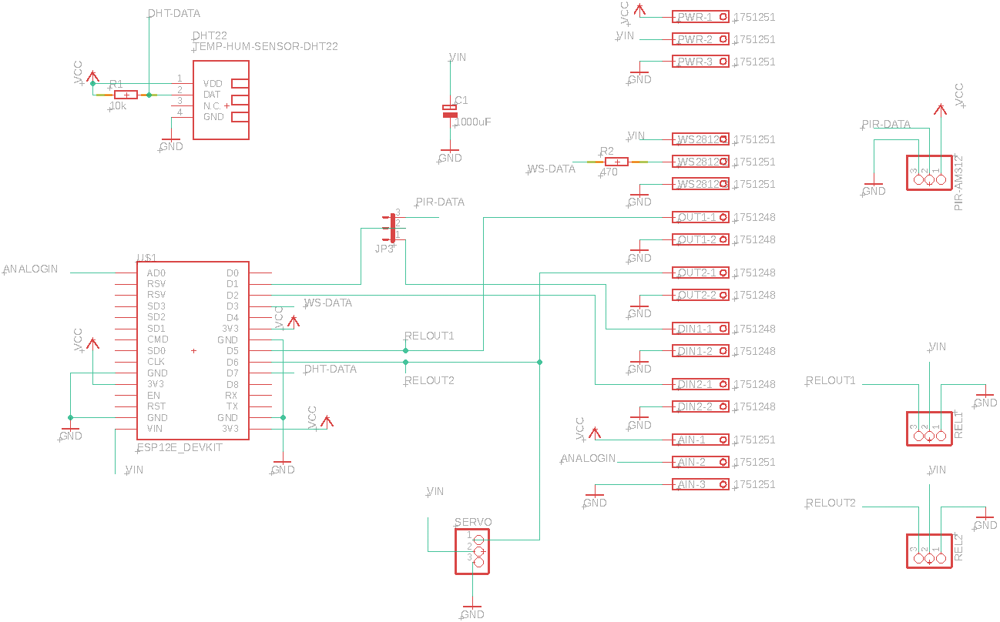
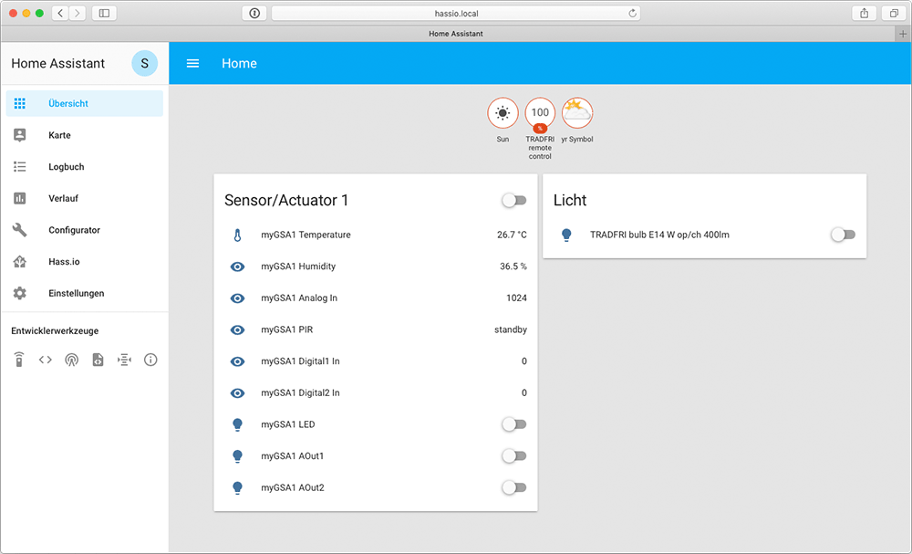

# General Sensor/Actuator for Hassio
 
This readme is organised in three parts:

- Overview
- Building the General Sensor/Actuator
- Configuration

## Overview



The General Sensor/Actuator (GSA) is a modular device to create functional smart home prototypes to test ideas with users.

It connects to the Home Assistant platform which allows us to prototype smart home applications. Home Assistant can connect to several available devices and makes automation and interoperability possible.

The GSA consists of a NodeMCU, a wifi enabled microcontroller, screw terminals connect sensors and actors to it, a DHT22 temperature and humidity sensor, a PIR sensor (motion sensor), a terminal to connect a servo motor to and two connections for relay modules.

The GSA is powered by a USB power supply.

#### Pins
- 1x Analog input (e.g. light sensors, potentiometers, water sensors)
- 1x WS2812 connector (addressable LEDs)
- 2x Digital input (e.g. buttons, switches, D1 shared through jumper with a digital motion sensor)
- 2x Analog output (PWM, e.g. dimmable lights, motors - can be used as digital outputs to attach Relais extension boards)
- 2x Relais output for extension boards (shared with the analog outputs)
- 1x Servo connector (shared with Analog output 2)

The configuration is mainly done through the firmware, the software running the GSA. The firmware is transferred through the Arduino IDE.

## Building the General Sensor/Actuator



BOM
- 2x 90° 1x3 pin header female
- Resistors: 1x 10k, 1x 470 ohms
- 2x 1x3 pin header male
- 2x 1x15 pin header female
- 2x 1x3 pin header female
- 1x AM312 digital PIR
- 3x screw terminals 3 pins
- 3x screw terminals 4 pins
- 1x DHT22
- 1x electrolytic capacitor 1000uF
- 1x NodeMCU (ESP 12E Module)

Building the GSA is relatively easy. You can order the PCBs using the files contained in the Eagle-folder of this repository from any PCB manufacturing service. Once you have the PCBs solder the following components. I suggest the following order:

- 2x 90° pin headers REL1 and REL2 (2x 1x3 pins female)
- Resistor RE1 with 10k and RE2 with 470 ohms
- Pin headers for SERVO and the jumper (2x 1x3 pins male)
- Pin header for the ESP module (2x 1x15 pins female)
- I recommend to solder a pin header for the digital PIR (1x 1x3 pins female)
- screw terminals (3x 3 pins, 2x 4 pins)
- DHT22
- Capacitor 1000uF



## GSA configuration

Now, let's connect a General Sensor/Actuator (GSA) to Hass.io. Three simple steps are needed:

Upload a configured firmware to the GSA
Change the configuration.yaml file of your Hass.io installation
Restart Hass.io
1. Upload a configured firmware to the GSA

(I assume you already configured the Arduino software. Otherwise, start here: Set up the Arduino IDE.)

Open the file gsa.ino (You can get it from Github) and fill out the network and security lines. In the device configuration, choose a unique device ID for the GSA. This can be as simple as «LivingRoomFirstFloor».

```
        
/************ Configuration for network and security ******************/

#define wifi_ssid "myWifiName"                        // type your WIFI name in here
#define wifi_password "myWifiPassword"                // your WIFI password
#define mqtt_server "192.168.1.211"                   // the IP of your mqtt broker, e.g. from your Raspbarry Pi running Hassio and the MQTT broker
#define mqtt_user "HassioUserName"                    // your mqtt user name, in the easiest case your Hassio username
#define mqtt_password "HassioPassword"                // your mqtt user password, in the easiest case your Hassio password
#define OTApassword "myFOTApassword"                  // defined by you! and used to upload new firmware from the Arduino-Software (FOTA: Firmware Over The Air)

/************ Device configuration ******************/

#define SENSORNAME "myGeneralSensorActuator007"       // choose an unique device ID for the gsa

boolean digital1opener = true;                        // defines, if digital 1 is opener or closer
boolean digital2opener = true;                        // defines, if digital 2 is opener or closer

boolean digitalIndicatorLED1 = true;                  // if true show indicator light for digital 1
boolean digitalIndicatorLED2 = true;                  // if true show indicator light for digital 1

boolean relay1 = false;                               // if true, relay can be used, if false analog output can be used (if false, don't connect a relais, it will be damaged by the pwm output!!)
boolean relay2 = false;                               // if true, relay can be used, if false analog output can be used (if false, don't connect a relais, it will be damaged by the pwm output!!)

boolean servo = false;                                // if true, servo can be used, if false analog output can be used (if false, don't connect a servo, it may get damaged by the pwm output!!)

boolean showCommunicationFlash = true;                // if true led flashes on data transmission

float diffAnalog = 20;                                // On how much difference should the analog sensore react on?

(this is just a code snipped from the original file gsa.ino)
    
```  
    
You can leave the rest unchanged and simply upload the program to your GSA.

Home Assistant configuration

Open the «configuration.yaml» file in the Configurator. Input the following lines to the light section. (There must only be one «light:» entry. If it already exists, put the child nodes in the existing light section.

```
light:
  - platform: mqtt
    schema: json
    name: "myGSA1 AOut1"  
    state_topic: "myGSA1/aout1"  
    command_topic: "myGSA1/aout1/set"  
    brightness: true   
    rgb: false  
    qos: 0
  - platform: mqtt
    schema: json
    name: "myGSA1 AOut2"  
    state_topic: "myGSA1/aout2"  
    command_topic: "myGSA1/aout2/set"  
    brightness: true   
    rgb: false  
    qos: 0
  - platform: mqtt
    schema: json
    name: "myGSA1 LED"  
    state_topic: "myGSA1"  
    command_topic: "myGSA1/set"  
    brightness: true  
    rgb: true  
    qos: 0  
```    

Now, input the following lines to the sensor section. (There must only be one «sensor:» entry. If it already exists, put the child nodes in the existing sensor section.

```
sensor:
  - platform: mqtt  
    state_topic: "myGSA1"  
    name: "myGSA1 Temperature"  
    unit_of_measurement: "°C"  
    value_template: '{{ value_json.temperature | round(1) }}'  
  - platform: mqtt  
    state_topic: "myGSA1"  
    name: "myGSA1 Humidity"  
    unit_of_measurement: "%"  
    value_template: '{{ value_json.humidity | round(1) }}'  
  - platform: mqtt  
    state_topic: "myGSA1"  
    name: "myGSA1 Analog In"
    value_template: '{{ value_json.analog }}'  

binary_sensor:
  - platform: mqtt
    state_topic: "myGSA1"
    name: "myGSA1 Digital1 In"
    value_template: '{{ value_json.digital1 }}'
    payload_on: "1"
    payload_off: "0"
  - platform: mqtt
    state_topic: "myGSA1"
    name: "myGSA1 Digital2 In"
    value_template: '{{ value_json.digital2 }}'
    payload_on: "1"
    payload_off: "0"
```

Save the configuratoin.yaml and open the groups.yaml file and input the following lines.

```
myGSA1_card: 
  name: Sensor/Actuator 1
  entities: 
    - sensor.myGSA1_temperature
    - sensor.myGSA1_humidity
    - sensor.myGSA1_analog_in
    - binary_sensor.myGSA1_digital1_in
    - binary_sensor.myGSA1_digital2_in
    - light.myGSA1_led
    - light.myGSA1_aout1
    - light.myGSA1_aout2
```

Now reboot your system. After the reboot, you should see the myGSA1 card in Hass.io.



I hope you find this setup as useful as I do. Have fun!