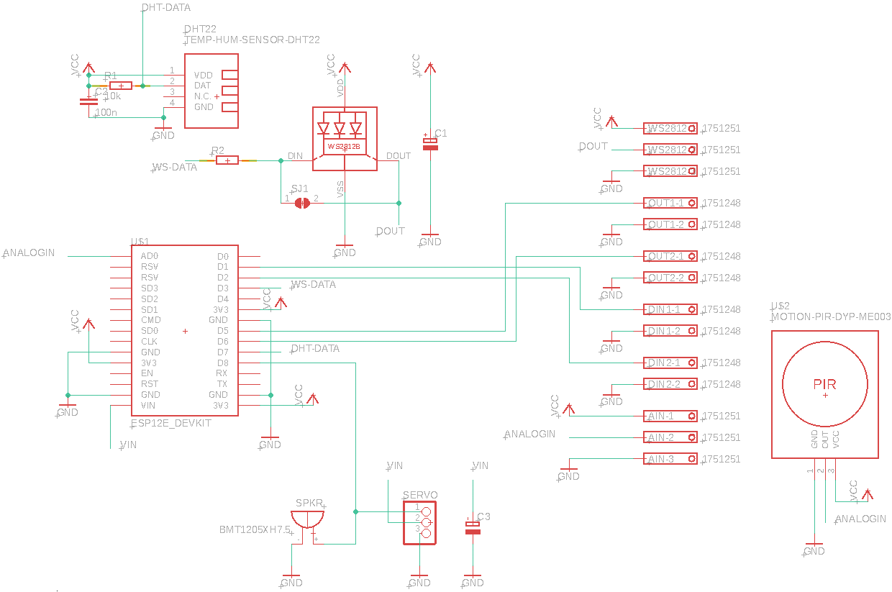
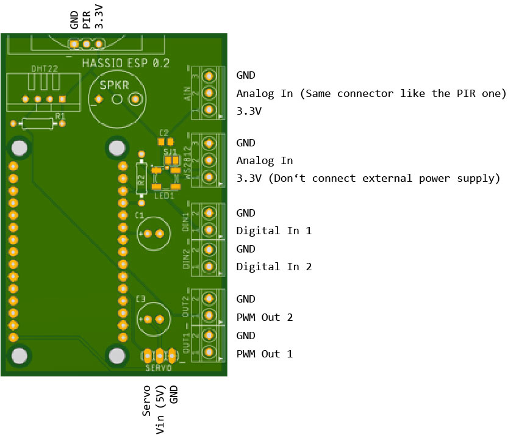

# HASSIO-EasyPrototyping

This project is currently under development. 

Fast and easy prototyping with the NodeMCU (with ESP8266). 

- D0: internal LED1 on NodeMCU showing if Digital Input 1 is high or low
- D1: Digital Input 1
- D2: Digital Input 2
- D3: Digital Output to WS2812 addressable RGB-LED
- D4: internal LED2 on NodeMCU showing if Digital Input 2 is high or low
- D5: Analog Output 1
- D6: Analog Output 2
- D7: Input from DHT22 temperature and humidity sensor
- D8: Output to Servo or Speaker (not implemented in code yet)
- ADC: Analog Input (e.g. potentiometer, PIR, etc.)

In this image you can see a breadboard build up with all supported components. The LEDs on D0 and D4 can be left away since there are internal LEDs on the NodeMCU

This is the PCB layout of a more compact and sustainable version. It is the R02 version currently in production. 

